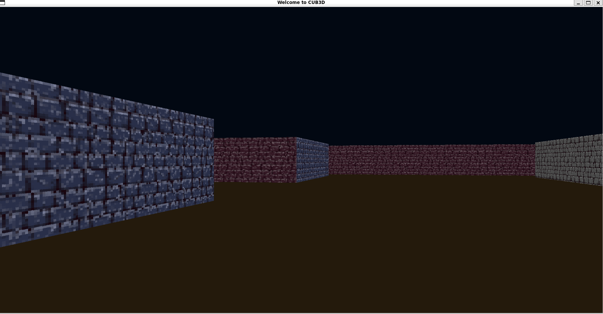
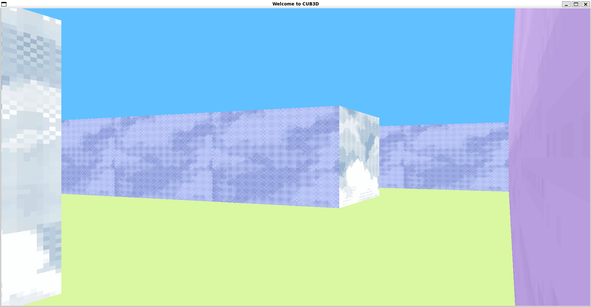
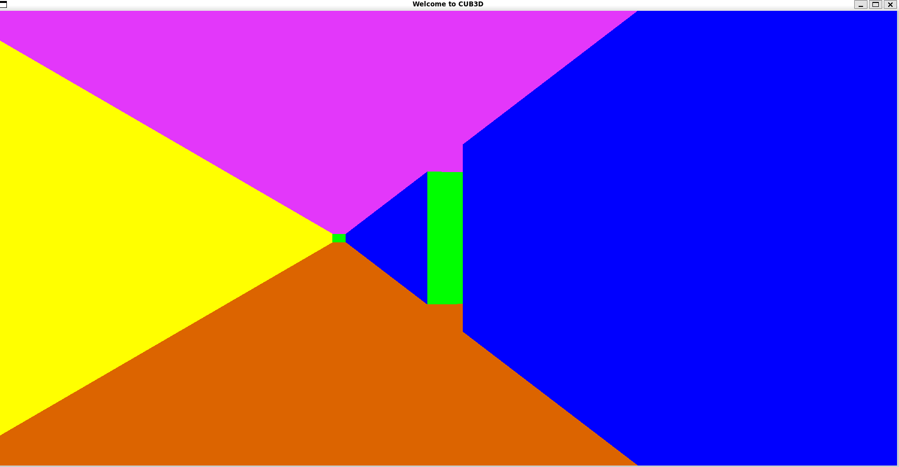
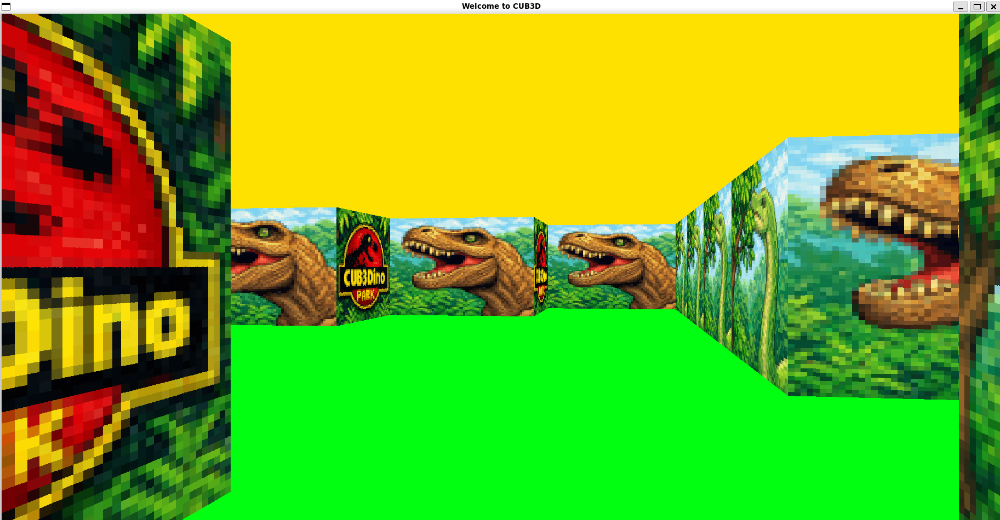
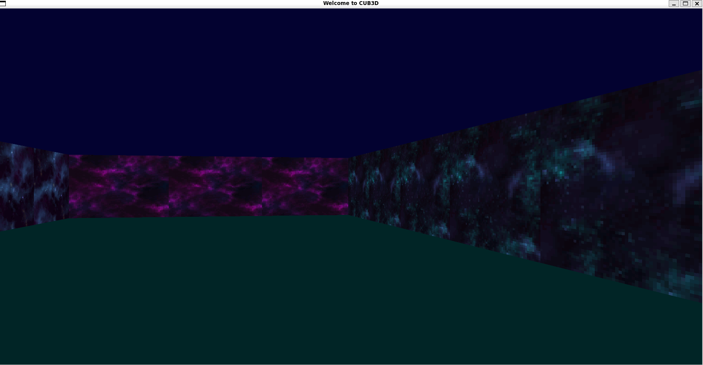
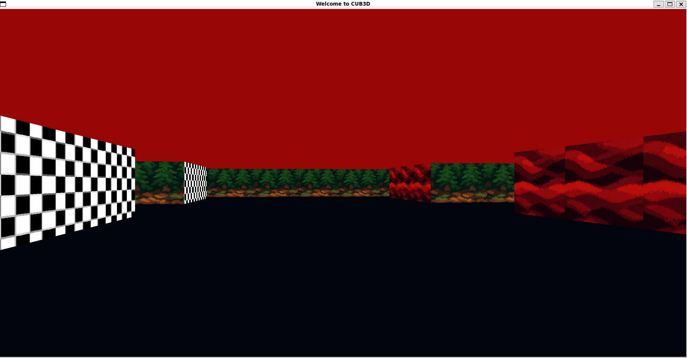

*This project has been created as part of the 42 curriculum by pafroidu and diade-so.*









## Description

Cub3D is a graphical project that challenged us to create a 3D maze game using ray-casting, inspired by the legendary Wolfenstein 3D (1992), the game that pioneered the first-person shooter genre. This project explores the fascinating intersection of mathematics, computer graphics, and game development.

**This was our second group project at 42**, building on the collaborative skills we developed during Minishell. The complexity of implementing a 3D game engine made teamwork essential: rendering engine, map parsing, player movement, texture mapping, and input handling all needed to work together seamlessly.

Through Cub3D, we learned:
- **Ray-casting**: The core algorithm that creates a 3D perspective from 2D data
- **Computer graphics**: Pixel manipulation, texture mapping, and rendering
- **MiniLibX**: Working with a simple graphics library for window and image management
- **Mathematical concepts**: Trigonometry, vectors, and distance calculations
- **Game development**: Player movement, collision detection, and event handling
- **Map parsing**: Reading and validating complex configuration files
- **Team synergy**: Coordinating parallel workstreams in a large codebase

## Team Collaboration

**Contributors:**
- [pafroidu](https://github.com/kidp8479)
- [diade-so](https://github.com/d2codex)

### Our Workflow

Building on our experience from Minishell, we refined our collaborative development practices for Cub3D. **After the success of working together for Minishell, we wanted to level up even more our group workflow and development practices.** The project's complexity, combining graphics programming, mathematical algorithms, and game mechanics, required rigorous coordination.

**Our Philosophy:**
For us, working cleanly as a group isn't just about dividing tasks, it's about **communication, documentation, and shared understanding**. We invested significant effort in establishing efficient practices and tools that would make our collaboration seamless and our codebase maintainable.

**Project Management:**
- **Notion Workspace**: Task management with Trello-style kanban boards
  - Features broken down into granular tickets
  - Each ticket assigned to a team member
  - Progress tracking through status columns
  - [Project workspace](https://graceful-indigo-a76.notion.site/cub3D-2b2456d6aba38182989bc59d9e070044) for team coordination

**Version Control Strategy:**
- **GitHub Flow**: Feature branch workflow
  - Each ticket worked on a dedicated feature branch
  - Branch naming follows ticket structure
  - Protected `main` branch
- **Atomic Commits**: Granular, logical commits
  - Each commit represents one complete change
  - Commit messages follow conventional commits format
- **Pull Request Process**:
  - Developer creates PR when feature is complete
  - **Notion Review Cards**: For each PR, we created explanation cards in Notion to help the reviewer understand:
    - What the feature does
    - Technical implementation details
    - Areas that need careful review
    - Test cases to verify
  - Reviewer reads the Notion card, then reviews the code
  - Discussion and iteration on the PR
  - Merge only after approval

**Documentation & Code Quality:**
- **Doxygen**: Comprehensive function documentation
  - Every function documented with purpose, parameters, return values
  - Module-level documentation for architecture understanding
  - Makes code review and onboarding much faster
  - Reviewers can understand complex algorithms without reading implementation

**Testing Strategy:**
We implemented comprehensive testing to ensure code quality:
- **Unit Tests**: Individual module testing (`tests/unit/`)
  - Parsing tests: `test_parse_header.c`, `test_parse_map.c`, `test_parse_rgb.c`
  - Validation tests: `test_file_validation.c`, `test_validate_map.c`
  - Player setup tests: `test_player_setup.c`
  - MLX initialization tests: `test_init_mlx.c`
  - Custom Makefile in `tests/` to build and run all tests
- **Integration Tests**: End-to-end testing with shell scripts
  - `test_valid_maps.sh`: Verifies all valid maps load correctly
  - `test_invalid_maps.sh`: Ensures invalid maps are rejected
  - `test_parse_header_integ.sh`: Full header parsing validation
  - Automated test scripts catch regressions quickly
- **Test Maps**: Extensive test map collection (`maps/`)
  - Valid maps for different scenarios
  - Invalid maps for edge case testing
  - Test-specific maps for headers, characters, enclosure

**Code Architecture:**
The project is organized into clear modules:
```
src/
├── events/        # Event handling (keyboard, mouse, game loop)
├── init/          # Initialization (MLX, data structures, textures)
├── parsing/       # .cub file parsing and validation
├── raycast/       # Ray-casting engine (DDA algorithm)
├── render/        # Pixel rendering and drawing
└── utils/         # Helper functions (cleanup, errors, etc.)
```

**What We Learned:**
- **Professional tools make a real difference**: Doxygen, Notion, and test automation elevated our workflow significantly
- **Notion review cards transformed our PR process**: Explaining the feature upfront made reviews faster and more focused
- **Modular architecture is essential**: Clear separation of concerns made parallel work possible
- **Test early, test often**: Unit tests caught issues before integration
- **Documentation in code**: Comprehensive Doxygen comments saved countless hours during code reviews
- **Graphics debugging is unique**: Visual bugs require different debugging approaches than logic bugs
- **Communication is everything**: Daily syncs and clear documentation prevented blockers and duplicate work

This project demonstrated that **good teamwork requires intentional practices and the right tools**. The investment in our workflow paid off with smoother collaboration, fewer bugs, and a maintainable codebase that both team members fully understood.

## Instructions

### Compilation

The project includes a Makefile with standard rules:

```bash
make        # Compiles cub3D
make clean  # Removes object files
make fclean # Removes object files and executable
make re     # Recompiles everything
```

### Compilation Flags

All source files must compile with:
```bash
cc -Wall -Wextra -Werror
```

You'll need to link with MiniLibX and math library (already well linked in the Makefile if you use the command `make` to compile the project):
```bash
# macOS
cc -Wall -Wextra -Werror *.c -Lmlx -lmlx -framework OpenGL -framework AppKit -lm

# Linux
cc -Wall -Wextra -Werror *.c -Lmlx_linux -lmlx_linux -lXext -lX11 -lm
```

### External Functions Allowed

**Standard I/O and memory:**
- `open`, `close`, `read`, `write`, `printf`, `malloc`, `free`, `perror`, `strerror`, `exit`

**Time:**
- `gettimeofday()`

**Math library:**
- All functions from `math.h` (`-lm`)

**MiniLibX:**
- All functions from the MiniLibX library

### Program Usage

```bash
./cub3D maps/valid/any_map_in_the_valid_folder.cub
```

The program takes a scene description file with `.cub` extension and displays the 3D view.

### Scene File Format (.cub)

The `.cub` file describes textures, colors, and the map layout:

**Texture identifiers** (path to `.xpm` file):
```
NO ./textures/north_wall.xpm    # North wall texture
SO ./textures/south_wall.xpm    # South wall texture
WE ./textures/west_wall.xpm     # West wall texture
EA ./textures/east_wall.xpm     # East wall texture
```

**Color identifiers** (RGB values 0-255):
```
F 220,100,0     # Floor color (RGB)
C 225,30,0      # Ceiling color (RGB)
```

**Map** (must be last element in file):
- `0`: Empty space (walkable)
- `1`: Wall
- `N`, `S`, `E`, `W`: Player starting position and orientation
- Spaces: Valid (part of the map, not walkable)

**Map rules:**
- Must be closed/surrounded by walls
- Only one player position
- No holes in walls allowing player to escape

**Example .cub file:**
```
NO ./textures/north.xpm
SO ./textures/south.xpm
WE ./textures/west.xpm
EA ./textures/east.xpm

F 220,100,0
C 225,30,0

        1111111111111111111111111
        1000000000110000000000001
        1011000001110000000000001
        1001000000000000000000001
111111111011000001110000000000001
100000000011000001110111111111111
11110111111111011100000010001
11110111111111011101010010001
11000000110101011100000010001
10000000000000001100000010001
10000000000000001101010010001
11000001110101011111011110N0111
11110111 1110101 101111010001
11111111 1111111 111111111111
```

### Controls

**Movement:**
- **W**: Move forward
- **A**: Strafe left
- **S**: Move backward
- **D**: Strafe right

**Camera:**
- **Left arrow**: Rotate view left
- **Right arrow**: Rotate view right

**Exit:**
- **ESC**: Close window and quit program
- **Red cross** (window close button): Close window and quit program

### Mandatory Requirements

**Graphics:**
- Use **MiniLibX** (system version or from sources)
- Implement **ray-casting** for 3D view
- Different wall texture for each cardinal direction (N, S, E, W)
- Different floor and ceiling colors
- Smooth window management (minimize, switch windows, etc.)

**Parsing:**
- Read and parse `.cub` scene description file
- Validate map (closed by walls, valid characters, one player)
- Validate texture paths (files exist and are readable)
- Validate colors (RGB values 0-255)
- Error handling with `"Error\n"` followed by explicit error message

**Gameplay:**
- Display 3D first-person view of the maze
- WASD movement through the maze
- Arrow key camera rotation
- Smooth player movement
- ESC and window close button exit cleanly

**Technical:**
- No global variables allowed
- All heap memory properly freed
- No memory leaks, segfaults, or undefined behavior

### Bonus Features

**Enhanced graphics:**
- Wall collisions (player can't walk through walls)
- Mouse rotation (in addition of arrow keys)

**Additional features list to be added (one day maybe):**
- Floor/ceiling textures (instead of solid colors)
- Enemies/sprites that move
- Health/score system
- Minimap system
- Doors (open/close with key press)
- Animated sprites

## Resources

### Ray-Casting Algorithm

- [Lode's Ray-Casting Tutorial](https://lodev.org/cgtutor/raycasting.html) - **Essential** comprehensive guide
- [Ray-Casting Tutorial (Game Engine)](https://permadi.com/1996/05/ray-casting-tutorial-table-of-contents/) - Step-by-step explanation
- [Wolfenstein 3D Source Code](https://github.com/id-Software/wolf3d) - Original 1992 implementation

### MiniLibX Documentation

- [MiniLibX Documentation (42 Docs)](https://harm-smits.github.io/42docs/libs/minilibx) - Comprehensive guide
- [MiniLibX Images](https://harm-smits.github.io/42docs/libs/minilibx/images.html) - Working with images
- [MiniLibX Events](https://harm-smits.github.io/42docs/libs/minilibx/events.html) - Event handling

### Mathematical Concepts

- [Digital Differential Analyzer (DDA)](https://en.wikipedia.org/wiki/Digital_differential_analyzer_(graphics_algorithm)) - Line drawing algorithm used in ray-casting
- [Trigonometry for Games](https://www.gamefromscratch.com/post/2015/06/02/GameDev-Math-Recipes-Trigonometry.aspx)
- [Vector Mathematics](https://www.mathsisfun.com/algebra/vectors.html)

### MiniLibX Installation

**Linux:**
```bash
# Ubuntu/Debian
sudo apt-get install libx11-dev libxext-dev libbsd-dev

# Clone and compile MiniLibX
git clone https://github.com/42Paris/minilibx-linux.git mlx_linux
cd mlx_linux
make
```

**macOS:**
```bash
# MiniLibX is pre-installed on 42 Macs
# Or download from:
git clone https://github.com/42Paris/minilibx-macos.git mlx
cd mlx
make
```

### Game Development

- [Game Programming Patterns](https://gameprogrammingpatterns.com/) - Essential patterns
- [Fixed Timestep Game Loop](https://gafferongames.com/post/fix_your_timestep/) - Smooth movement
- [Wolfenstein 3D (Wikipedia)](https://en.wikipedia.org/wiki/Wolfenstein_3D) - Historical context

### Testing and Debugging

**Running Unit Tests:**
```bash
cd tests/
make                             # Build and run all unit tests
make build TEST=unit/test_name.c # Build a single test
make clean                       # Clean test artifacts
```

**Running Integration Tests:**
```bash
cd tests/
./test_valid_maps.sh          # Test all valid maps
./test_invalid_maps.sh        # Test all invalid maps
./test_parse_header_integ.sh  # Test header parsing
./test_validate_map_integ.sh  # Test map validation
./test_player_setup_integ.sh  # Test player initialization
```

**Manual Testing:**
```bash
# Test with valgrind for memory leaks
valgrind --leak-check=full --show-leak-kinds=all ./cub3D maps/valid/simple.cub

# Test valid maps
./cub3D maps/valid/basic.cub
./cub3D maps/valid/complex.cub

# Test invalid maps (should display appropriate errors)
./cub3D maps/invalid/not_closed.cub
./cub3D maps/invalid/invalid_char.cub
./cub3D maps/invalid/no_player.cub
./cub3D maps/invalid/duplicate_player.cub
```

**Unit Test Structure:**
Our unit tests are located in `tests/unit/` and compile to `tests/bin/`. Each test targets a specific module:
- `test_file_validation`: Tests .cub filename validation
- `test_parse_header`: Tests header parsing (textures, colors)
- `test_parse_map`: Tests map grid parsing
- `test_validate_map`: Tests map enclosure validation
- `test_player_setup`: Tests player position and orientation
- `test_init_mlx`: Tests MLX initialization

Example unit test output:
```
Running all tests...
=== Test: test_file_validation ===
[OK] Valid .cub filename
[OK] Invalid extension rejected
[OK] Hidden file rejected
...
```

## Notes

**Implementation Architecture:**

Our implementation follows a modular pipeline, as seen in `src/main.c`:

1. **Argument Validation** (`src/parsing/file_validations.c`)
   - Check `.cub` file extension
   - Verify file exists and is readable

2. **Parsing & Validation** (`src/parsing/`)
   - `parse_and_validate_cub()`: Main parsing orchestrator
   - `parse_header()`: Extract textures (NO, SO, WE, EA) and colors (F, C)
   - `parse_map()`: Load map grid from file
   - `validate_map()`: Check map enclosure, valid characters
   - `player_setup()`: Find and initialize player position/orientation

3. **Graphics Initialization** (`src/init/`)
   - `init_graphics()`: Initialize MLX connection and window
   - `init_textures()`: Load `.xpm` textures into memory
   - Create image buffer for rendering

4. **Event Setup** (`src/events/`)
   - `setup_hooks()`: Register keyboard and mouse handlers
   - Key press/release tracking for smooth movement
   - Mouse movement for camera rotation

5. **Game Loop** (`src/events/game_loop.c`)
   - Called every frame via `mlx_loop_hook()`
   - Update player position based on key states
   - Render frame (ray-casting + texture mapping)
   - Display frame to window

6. **Ray-Casting** (`src/raycast/`)
   - `raycast()`: Main ray-casting function
   - `dda()`: Digital Differential Analyzer algorithm
   - Calculate wall distances and heights
   - Determine texture coordinates

7. **Rendering** (`src/render/`)
   - `draw_pixels()`: Draw ceiling, walls, and floor
   - Fast pixel manipulation using image buffer
   - Texture sampling and color application

**Ray-Casting Core Algorithm:**

```
For each vertical stripe on screen (x = 0 to width):
  1. Calculate ray direction based on camera angle and x position
  2. Use DDA to find next wall hit in map
  3. Calculate perpendicular distance to wall
  4. Calculate wall height on screen (inversely proportional to distance)
  5. Calculate texture x-coordinate based on hit position
  6. Draw vertical stripe with correct texture portion
  7. Draw floor and ceiling colors
```

**Important Considerations:**

- **Fisheye correction**: Use perpendicular distance, not Euclidean distance
- **Texture orientation**: Flip textures based on wall side and ray direction
- **Performance**: Use images for fast pixel manipulation (not `mlx_pixel_put`)
- **FOV (Field of View)**: Controlled by camera plane vector (typically 66 degrees)
- **Frame-independent movement**: We decoupled movement speed from window size and framerate using `gettimeofday()`
  - Movement speed calculated based on elapsed time, not frame count
  - Ensures consistent movement speed regardless of window size or system performance
  - Player moves at constant real-world speed (e.g., units per second)
  - Critical for smooth gameplay on different machines and window sizes
- **Memory management**: Load textures once, destroy on exit
- **Map validation**: Thoroughly check all map edge cases

## Known Limitations

While our implementation is robust and passes all project requirements, we've identified a few edge cases:

**Corner Teleportation:**
- In very specific situations at map corners, the player may experience brief "teleportation" effects
- **Technical explanation**: This occurs when collision detection resolves the player's position at the exact intersection of two perpendicular walls. The collision system, attempting to push the player away from both walls simultaneously, can occasionally resolve to an unexpected position on the other side of one wall
- **Impact**: Rare occurrence, does not cause segfaults or crashes, and typically requires deliberate movement into precise corner positions
- **Workaround**: Improved collision resolution would require more sophisticated vector-based collision detection, which is beyond the project scope
- Player can easily move away from such positions without issue

**Why we kept it:**
- The issue is cosmetic and extremely rare in normal gameplay
- Fixing it would require significant refactoring of the collision system
- The project requirements focus on core functionality (ray-casting, parsing, textures), all of which work correctly
- No memory errors or crashes occur—the game remains stable

This limitation demonstrates the complexity of collision detection in game development and the trade-offs between perfect edge case handling and project delivery timelines.

---

**This is a school project.** The code was validated and pushed to the school's Git repository after evaluation. The Git history in this public repository may not reflect the complete development process, as it represents the final version after successful validation.


